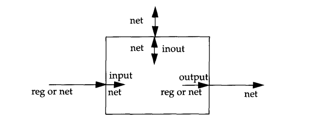

# Módulos y puertos

Los módulos son las unidades básicas de diseño. Representan bloques de hardware que pueden ser combinados para construir sistemas digitales más complejos. 

## a. Modulos

**Estructura de un Módulo:**

- **Declaración del Módulo:** Define el nombre del módulo y sus puertos.
- **Declaración de Puertos:** Especifica los tipos y la dirección de los puertos (entrada, salida o bidireccional).
- **Declaraciones Internas:** Incluye registros, cables y otros módulos internos.
- **Descripción del Comportamiento o Estructura:** Describe cómo el módulo se comporta o se conecta internamente.

Ejemplo:

~~~verilog
module and_gate (
    input wire a,      // Entrada a
    input wire b,      // Entrada b
    output wire y      // Salida y
);
    // Descripción del comportamiento del módulo
    assign y = a & b;  // y es la AND de a y b
endmodule
~~~

## b. Puertos
Los puertos proveen un interfaz con la cual los modulos se pueden comunicar con su entorno. 

### b.1 Lista de puertos
El módulo puede contener una lista de puertos que interaccionar con su entorno, caso contrario, el modulo no tendría lista de puertos.

Ejemplos:

~~~verilog
module fulladder4(sum, c_out, a, b, c_in);  //Modulo con lista de puertos

module top; // modulo sin lista de puertos.
~~~

### b.2 Declaración de puertos

Todos los puertos dentro de la lista de puertos deben estar declarados en el modulo

| Varilog Keyword   | Type of port |
|----------|----------------------------|
| **input**  | Puerto de entrada|
| **output** | Puerto de salida |
| **inout** | Puerto bidireccional |

Ejemplo:
~~~verilog
module fulladder4(sum, c_out, a, b, c_in);
    // Declaraciónd de puertos
    output [3:0] sum;
    output c_out;
    input [3:0] a, b;
    input c_in;

    // código interno
endmodule
~~~

**`#NOTA:`** Tener en cuenta que todas las declaraciones de puertos se declaran implícitamente como wire en Verilog. Por lo tanto, si un puerto está destinado a ser un wire, es suficiente declararlo como output, input o inout. Los puertos de entrada o bidireccionales normalmente se declaran como wire. **Sin embargo, si los puertos de salida mantienen su valor, deben ser declarados como reg**. 

Por ejemplo, en la definición de DFF, se requiere que la salida retenga su valor hasta el siguiente flanco de reloj. Las declaraciones de puertos para DFF se verán como se muestra en el Ejemplo.

~~~verilog
module FDD(q, d, clk, reset);
    output q;
    reg q;  // La salida q, retiene el valor con el uso del registro
    input d, clk, reset;
endmodule
~~~

Los puertos de tipo input e inout no pueden ser declarados como reg porque las variables reg almacenan valores y los puertos de entrada no deben almacenar valores, sino simplemente reflejar los cambios en las señales externas a las que están conectados.

### b.3 Reglas de conexiones de puertos (en instancias)

Se debe visualizar los puertos como un conjunto de dos unidades. Una unidad interna al módulo y otra externa, ambas conectadas entre si. 

- **`Inputs:`** Internamente, los puertos de entrada deberían ser del tipo net. Externamente, las entradas se pueden conectar a una variable como un registro o net.

- **`Outputs:`** Internamente, las salidas pueden ser del tipo reg o net. Externamente, deberían conectarse a una net. No se pueden conectar a registros.

- **`Inouts:`** Internamente, los puertos inouts deberían siempre ser del tipo net. Externamente, deberian conectarse siempre a luna net. 

- **`Width matching`** Es ilegal tanto interna como externamente conectar elementos de distinto tamaño cuando se hacen conexiones dentro del módulo. 

- **`Unconnected ports`** Verilog permite dejar puertos sin conectar. Pueden ser de utilidad cuando se requiere debuggear.

### b.4 Conectar puertos a señales externas
Existen dos métodos en Verilog para conectar los puertos. Estos métodos no pueden ser mezclados.
### b.4.1 Por lista ordenada
~~~verilog
module Top;
    // Declaración 
    reg [3:0]A, B;
    reg C_IN;
    wire [3:0] SUM;
    wire C_OUT;
    
    // Instancias 
    // Señales conectadas en orden de acuerdo a las declaraciones en el modulo

    // Observar primero el modulo de fulladder y observar como estan declarados los puertos
    fulladder adder(SUM, C_OUT, A, B, C_IN);
~~~
### b.4.2 Por nombre

Conectar los módulos por nombre es recomendable cuando se tiene una gran cantidad de puertos. 

~~~verilog
module Top;
    // Declaración 
    reg [3:0]A, B;
    reg C_IN;
    wire [3:0] SUM;
    wire C_OUT;
    
    // Instancias 
    // Señales conectadas en orden de acuerdo a las declaraciones en el modulo

    // Observar primero el modulo de fulladder y observar como estan declarados los puertos
    fulladder adder(.sum(SUM), .c_out(C_OUT), .a(A), .b(B), .c_in(C_IN));
~~~

De este modo no es necesario poner los puertos en el orden en el que se declararon en el módulo instanciado. Por ejemplo

~~~verilog
fulladder adder(.c_in(C_IN), .c_out(C_OUT), .a(A), .b(B) .sum(SUM));
~~~

Si se deseara dejar desconectado un puerto, se puede dejar en blanco ese espacio.

Ejemplo, se desea dejar desconectado la salida c_out

~~~verilog
fulladder adder(.c_in(C_IN), .a(A), .b(B) .sum(SUM));
~~~